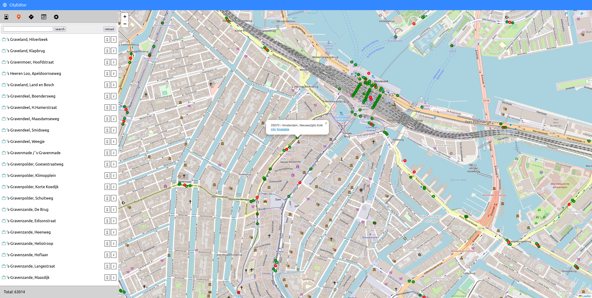
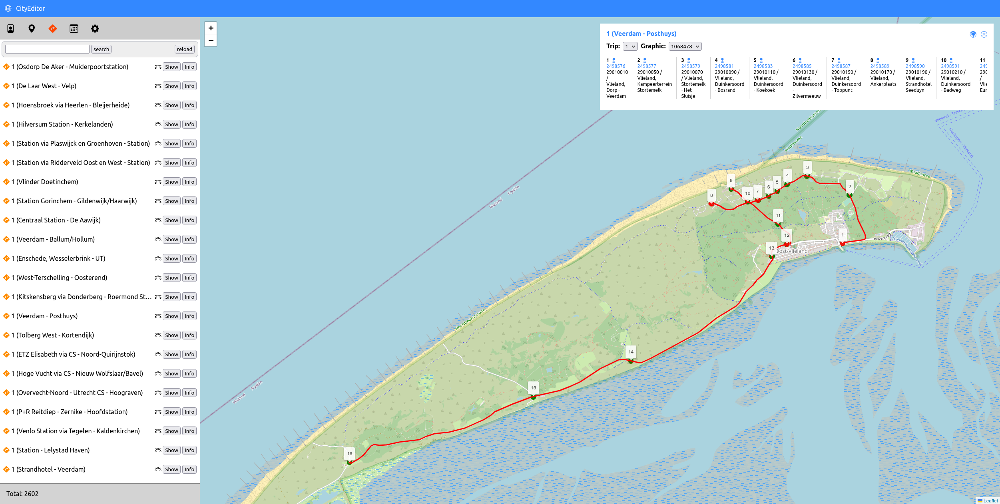
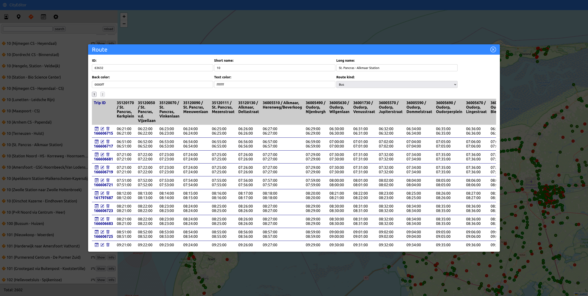

# CityVehicleEditor

**CityVehicleEditor** is a web application for creating and editing public transit data and mobility data in [CityVehicleSpec](https://vchezganov.github.io/cityvehiclespec/) format.
In addition, it can be used for exploring [GTFS](https://developers.google.com/transit/gtfs/) data.

### CityVehicleSpec
| Storage          | View               | Edit               | Versioning         | Multiedit         |
|------------------|--------------------|--------------------|--------------------|--------------------|
| **Local folder** | :heavy_check_mark: | :heavy_check_mark: | :x:                | :interrobang:      |
| **MongoDB**      | :heavy_check_mark: | :heavy_check_mark: | :interrobang:      | :interrobang:      |
| **DynamoDB**     | :heavy_check_mark: | :heavy_check_mark: | :heavy_check_mark: | :heavy_check_mark: |

### GTFS
| Storage          | View               | Edit               | Versioning         | Multiedit          |
|------------------|--------------------|--------------------|--------------------|--------------------|
| **Local folder** | :heavy_check_mark: | :x:                | :x:                | :x:                |

### Screenshots

### Stack
[GoLang](https://go.dev/),
[VueJS](https://vuejs.org/),
[Pinia](https://pinia.vuejs.org/),
[Leaflet](https://leafletjs.com/)
